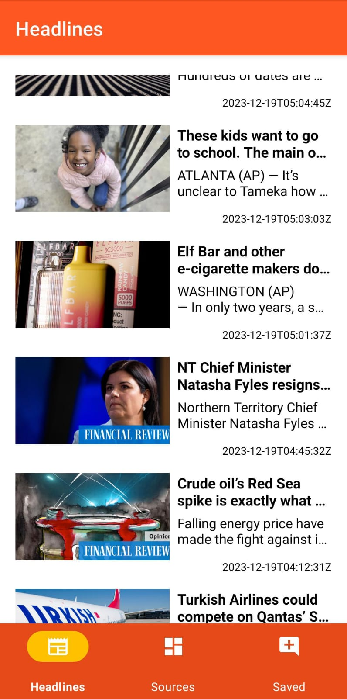
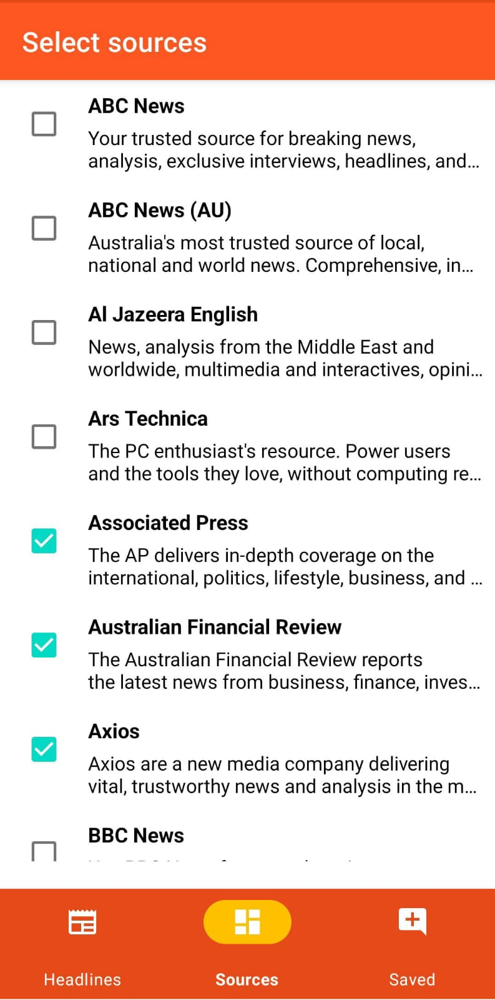
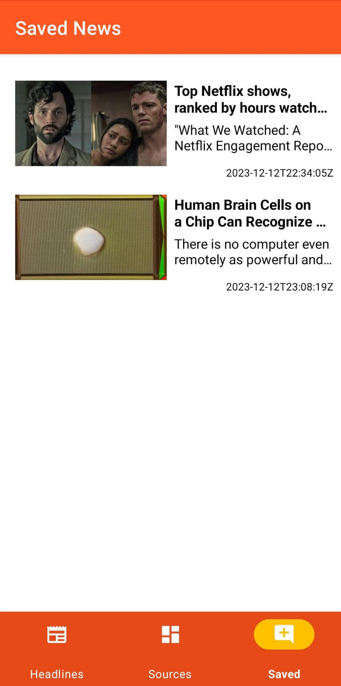

# Demo Android Application - Kotlin MVVM News Reader

Welcome to the Demo Android Application built with **Kotlin** and following the **MVVM** architecture! This app utilizes the **News API** to fetch news from various sources, providing users with a seamless and intuitive news-reading experience.

## Features:

1. **News Source Selection:**
   - Users can choose their preferred news sources, tailoring the content to their interests.

2. **Dynamic Results:**
   - The application dynamically fetches news based on the user's source selection, ensuring a personalized news feed.

3. **Save for Later:**
   - Mark articles as "read for later" to save and revisit interesting reads.

## Technology Stack:

- **Kotlin:** The modern and expressive programming language for Android development.
  
- **MVVM Architecture:** A design pattern that separates the app into three main components (Model, View, ViewModel), promoting clean and maintainable code.

- **News API Integration:** Seamless integration with the News API for real-time and up-to-date news content.

- **Other libraries used:** Room (for Database), Coroutines, Dependency Injection (Hilt), View Binding, JUnit, Glide, Retrofit

## Screenshots:

